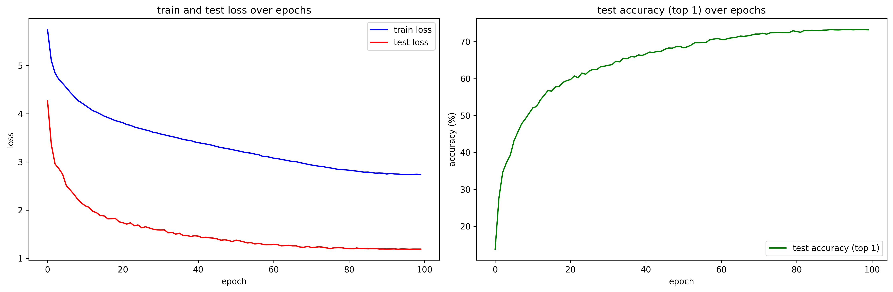

## pretraining
```
python -m pretraining --save_dir pretrained_weights \
                      --model_name MCG-NJU/videomae-base \
                      --n_epoch 400 \
                      --batch_size 64 \
                      --lr 5e-4 \
                      --n_worker 16 \
                      --n_device 8 \
                      --precision bf16-mixed \
                      --dtype bfloat16 \
                      --strategy ddp \
                      --save_frequency 20 \
                      --input_size 224 \
                      --mask_ratio 0.9 \
                      --tubelet_size 2 \
                      --norm_pix_loss
```

## finetuning
```
python -m train --save_dir weights \
                --model_name MCG-NJU/videomae-base-finetuned-kinetics \
                --pretrained \
                --pretrained_name MCG-NJU/videomae-base \
                --pretrained_dir pretrained_weights \
                --n_epoch 100 \
                --batch_size 32 \
                --lr 5e-4 \
                --n_worker 16 \
                --n_device 8 \
                --precision bf16-mixed \
                --dtype bfloat16 \
                --strategy ddp \
                --save_frequency 5 \
                --label_smoothing 0.1 \
                --input_size 224 
```

## result
- it takes about 60 hours for pretraining using `8 x RTX 4090`
- it takes about 18 hours for finetuning using `8 x RTX 4090`

|metric|top1_acc|top5_acc|
|---|---|---|
|this repo|78.64|93.65|
|official repo|79.99|94.42|

